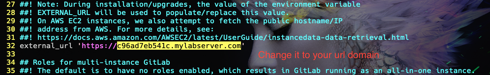

# GitLab Installation


## Installation requirements
### Operating Systems
#### Supported Linux distributions

- Ubuntu (16.04/18.04/20.04)
- Debian (9/10)
- CentOS (7/8)
- openSUSE Leap (15.2)
- SUSE Linux Enterprise Server (12 SP2/12 SP5)
- Red Hat Enterprise Linux (please use the CentOS packages and instructions)
- Scientific Linux (please use the CentOS packages and instructions)
- Oracle Linux (please use the CentOS packages and instructions)

#### Unsupported Linux distributions and Unix-like operating systems

- Arch Linux
- Fedora
- FreeBSD
- Gentoo
- macOS

## Prepare enviroment `CentOS-7`

> Install somes software requirement 

``` 
sudo yum install -y curl policycoreutils-python openssh-server openssh-clients
```


> Only intall openssh-server and openssh-clients if your server does not installed them yet.

> You can skip firewall-cmd if your server does installed

```
sudo firewall-cmd --permanent --add-service=https
sudo firewall-cmd --permanent --add-service=http
```

> Install mail postfix

```
sudo yum install postfix

sudo systemctl enable postfix

sudo systemctl start postfix

sudo systemctl status postfix
```


> Dowload and install gitlab script 

```
curl -sS https://packages.gitlab.com/install/repositories/gitlab/gitlab-ce/script.rpm.sh | sudo bash
```


> Now install gitlab-ce 

```
sudo yum install -y gitlab-ce
```


> Wait for a while gitlab-ce is installing

> If you wanna access gitlab web-base on https. You need add some cerfiticate for it

```
mkdir -p /etc/gitlab/ssl && cd /etc/gitlab/ssl

openssl genrsa -out key.pem 2048

openssl req -out crs.csr -key key.pem -new

openssl req -x509 -sha256 -days 356 -key key.pem -in crs.csr -out certificate.pem
```
```
chmod 700 /etc/gitlab/ssl
```

> Add certificate that you just created in to gitlab config file `/etc/gitlab/gitlab.rb`

```
sudo vim /etc/gitlab/gitlab.rb
```
> In this file you need edit two parts

> First part is `external_url` this is `url` that you will use to access to gitlab using web browser



> If you create certificate in previous steps you will need to change these line

> Press escape to exit from insert mode in vim. Press / to find these pattern
`/ssl_certificate`


> Press `:wq` to save what you have changed

> After these step you need to reconfigure Gitlab Server to update these changes

```
sudo gitlab-ctl reconfigure
```

> You will need to wait for progress reconfigure complete.


> After finished these step. Now you can access your `GitLab Server` through web-interface.
>Open Web-browser and use `url` that you configure in `gitlab.rb`. In my case this will be `https://c96ad7eb541c.mylabserver.com`


>Now you can login using user `root` and password `admin`
