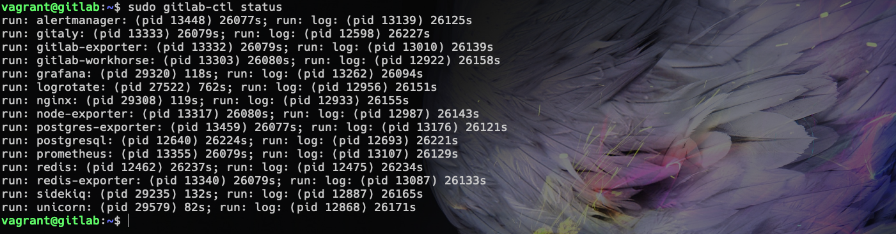
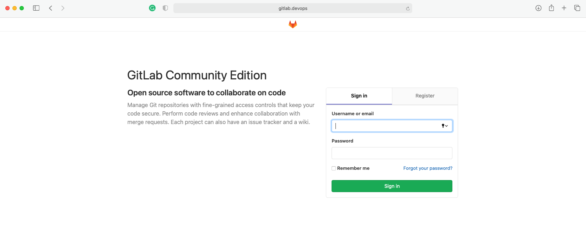

# <span style="color:blue">**Install GitLab CE with Vagrant.**</span>

> In this tutorial you will able to install GitLab Community Edition locally on your mac using a vagrant box. This tutorial has been tested with my macOS 10.15 and at the time of writing this tutorial, the latest version of GitLab CE is 12.9.3 and the latest version of Ubuntu is 18.04 (bionic64)

## Required

First you must make sure all the following are installed


- Vagrant - [Dowload Vagrant](https://www.vagrantup.com/downloads) 
- Virtual Box [Dowload VirtualBox](https://www.virtualbox.org/wiki/Downloads)

> ### NOTE:
> Ruby is version 2.0 and above are included by default in MacOS relesea since at leat EL Caption (10.11)

You should already have `ruby` installed so lets check this first.

```
ruby -v
```
<span style="color:red">**or**</span>
```
/usr/bin/ruby -v
```
This should output something like
```
  ruby 2.6.3p62 (2019-04-16 revision 67580) [universal.x86_64-darwin19]
```

## <span style="color:green"> 1. Create the Vagrantfile</span>

At first in the terminal make the directory that will be used for the GitLab CE installation and set it as default, so for this example `gitlab-devops`

```
mkdir gitlab-devops
```
Then create a vagrant file.
```
vagrant init
```
Now open this file.
```
vim Vagrantfile
```
Replace the content with the following - you may need to change the forwarded_port and private_network to your own settings.

-------------------------------------------------------------
```
# -*- mode: ruby -*-
# vi: set ft=ruby :

VAGRANTFILE_API_VERSION = "2"

Vagrant.configure(VAGRANTFILE_API_VERSION) do |config|
  config.vm.box = "ubuntu/bionic64"
  config.vm.hostname = "gitlab.local"

  if Vagrant.has_plugin?("vagrant-vbguest")
    config.vbguest.auto_update = false
  end

  config.vm.network "forwarded_port", guest: 80, host: 8080
  config.vm.network "forwarded_port", guest: 22, host: 8022

  config.vm.network "private_network", ip: "192.168.33.44"
  config.vm.synced_folder ".", "/vagrant", type: "rsync", rsync__exclude: [".git/"]

  config.vm.provider "virtualbox" do |vb|
    # Display the VirtualBox GUI when booting the machine
    #vb.gui = true
    vb.name = "gitlab.local"
    # Customize the amount of memory on the VM:
    vb.memory = "4096"
  end

  config.vm.provision "shell", inline: <<-SHELL
    sudo apt-get update
    sudo apt-get install -y curl openssh-server ca-certificates

    debconf-set-selections <<< "postfix postfix/mailname string $HOSTNAME"
    debconf-set-selections <<< "postfix postfix/main_mailer_type string 'Internet Site'"
    DEBIAN_FRONTEND=noninteractive sudo apt-get install -y postfix

    if [ ! -e /vagrant/ubuntu-bionic-gitlab-ce_12.9.3-ce.0_amd64.deb ]; then
        wget --content-disposition -O /vagrant/ubuntu-bionic-gitlab-ce_12.9.3-ce.0_amd64.deb https://packages.gitlab.com/gitlab/gitlab-ce/packages/ubuntu/bionic/gitlab-ce_12.9.3-ce.0_amd64.deb/download.deb
    fi
    sudo dpkg -i /vagrant/ubuntu-bionic-gitlab-ce_12.9.3-ce.0_amd64.deb
    sudo gitlab-ctl reconfigure
  SHELL
end
```
-------------------------------------------------------------
Now startup the vagrant box, this will initially take a while to install all the required file such as GitLab CE
```
vagrant up 
```
Change the host file to recognise `http://gitlab.devops` in your browser by opening the following which should also asked for your password.
```
sudo vim /private/etc/hosts
```
Then add the following line at the bottom and save it.
```
192.168.33.44 gitlab.devops
```

## <span style="color:green"> 2. Change the default hosting url (gitlab.example.com) for GitLab CE</span>

Access the Ubuntu terminal of the virtual box.
```
vagrant ssh
```
Now in the same terminal window edit the following file.
```
sudo vim /etc/gitlab/gitlab.rb
```
And find and replace
```
external_url 'http://gitlab.examle.com'
```
with
```
external_url 'http://gitlab.devops'
```
Then enter the following command for change the effect.
```
sudo gitlab-ctl reconfigure
```
After finished you can check status of GitLab by using this command
```
sudo gitlab-ctl status
```


## <span style="color:green"> 3. Login to Gitlab CE dasboard</span>

Open your browser with url `http://gitlab.devops`. The first time arround it will ask you to change the password.

 
