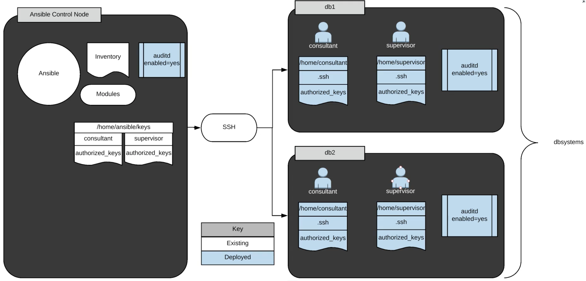

## Ad-Hoc Ansible Commands

### The Scenario

Some consultants will be performing audits on a number of systems in our company's environment. We've got to create the user accounts listed in /home/ansible/userlist.txt and set up the provided public keys for their accounts. The security team has built a jump host for the consultants to access production systems and provided us with the full key-pair so we can set up and test the connection. All hosts in dbsystems will need that public key installed so the consultants may use key-pair authentication to access the systems. We must also ensure the auditd service is enabled and running on all systems.


Important notes:

Ansible is already on the control node. If we connect to the server by clicking on the Public IP address in a web browser, we need to make sure we change to the ansible user, with the
``` 
sudo su - ansible command.
```
The user ansible is present on all servers with appropriate shared keys for access to managed servers from the control node. We need to make sure we use this user to complete the commands.
The ansible user has the same password as vagrant.
The default Ansible inventory has already been configured with the appropriate hosts and groups.
/etc/hosts entries are present on the control1 host for the managed servers.
Get Logged In

Login credentials are all on the lab overview page. Once we're logged into the control1 server, become the ansible user (su - ansible) and we can get going.

Create the User Accounts Noted in /home/ansible/userlist.txt

If we read the userlist.txt file in our home directory, we'll see consultant and supervisor. Those are the two new user accounts we have to create:
```
[ansible@control1]$ ansible dbsystems -b -m user -a "name=consultant"
```
```
[ansible@control1]$ ansible dbsystems -b -m user -a "name=supervisor"
````
Place Key Files in the Correct Location,
 `/home/$USER/.ssh/authorized_keys,` on Hosts in dbsystems
```
[ansible@control1]$ ansible dbsystems -b -m file -a "path=/home/consultant/.ssh state=directory owner=consultant group=consultant mode=0755"
```
```
[ansible@control1]$ ansible dbsystems -b -m copy -a "src=/home/ansible/keys/consultant/authorized_keys dest=/home/consultant/.ssh/authorized_keys mode=0600 owner=consultant group=consultant"
```
```
[ansible@control1]$ ansible dbsystems -b -m file -a "path=/home/supervisor/.ssh state=directory owner=supervisor group=supervisor mode=0755"
```
```
[ansible@control1]$ ansible dbsystems -b -m copy -a "src=/home/ansible/keys/supervisor/authorized_keys dest=/home/supervisor/.ssh/authorized_keys mode=0600 owner=supervisor group=supervisor"
```
Ensure auditd Is Enabled and Running on All Hosts
```
[ansible@control1]$ ansible all -b -m service -a "name=auditd state=started enabled=yes"
```
Conclusion

We can see, by watching output from those commands, that they all ran successfully. Congratulations!